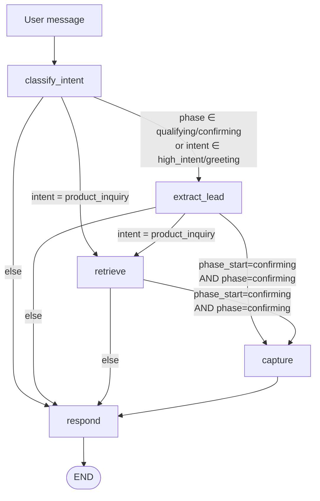

# AutoStream Agent

A LangGraph-based conversational agent that moves users from product
questions to captured leads for **AutoStream**, a SaaS platform for
automated video editing. The agent answers feature / pricing / policy
questions over a FAISS-backed RAG, extracts lead info across multiple
turns, and fires a mock lead-capture tool only after all three slots
(name, email, platform) are filled, the email passes validation, and
the user explicitly confirms.

## Live

- **Landing page:** [23f2004467-lgtm.github.io/autostream-agent/design/landing/Landing%20Page.html](https://23f2004467-lgtm.github.io/autostream-agent/design/landing/Landing%20Page.html)
- **Portfolio hub** (all 6 artifacts): [23f2004467-lgtm.github.io/autostream-agent/design/](https://23f2004467-lgtm.github.io/autostream-agent/design/)
- **Chat with the agent:** [autostream-agent-yor2zpfuuypeitjohgtmml.streamlit.app](https://autostream-agent-yor2zpfuuypeitjohgtmml.streamlit.app/)

The landing page's "Start free →" and "Chat with the agent" CTAs
both open the live Streamlit agent.

## Design portfolio

Full design system + six polished artifacts are in [`design/`](design/) —
open [`design/index.html`](design/index.html) locally or via the
Portfolio hub URL above to browse:

- **Landing page** — bold display type, orange accent, creator-energy
- **Chat UI** — custom web widget + WhatsApp mobile mockup, every phase on a pannable canvas
- **Pitch deck** — 10-slide investor deck at 1920×1080
- **Architecture diagram** — 5-node LangGraph flow, phase state machine, tool-capture locks
- **Animated storyboard** — 45-second Stage/Sprite walkthrough of the full conversation
- **Interactive prototype** — scripted + live-LLM modes with a state inspector

The Streamlit app is skinned with the same design tokens
(`design/shared/tokens.css`): electric orange `#FF5A1F` on near-black
`#0A0A0A`, Space Grotesk display + Inter body + JetBrains Mono chips.

> Built for the ServiceHive ML Intern take-home. Stack note: the plan
> originally targeted **Gemini 1.5 Flash** for LLM calls, but Google
> has since retired that model and the remaining free-tier Gemini
> models cap at ~20 requests/day — not enough to run the test suite
> end-to-end. We swapped to **Groq + Llama 3.1 8B Instant** (free tier,
> 14.4K req/day + 500K tok/day, same structured-output surface). A
> single import line and one env var are the only differences — swap
> `LLM_MODEL=llama-3.3-70b-versatile` in `.env` if you prefer the
> larger model and have budget.

## Setup

```bash
python -m venv .venv
source .venv/bin/activate
pip install -r requirements.txt
cp .env.example .env                 # then paste your GROQ_API_KEY
python scripts/warmup.py             # pre-build FAISS cache (one-off)
streamlit run app.py                 # open the chat UI
# or
python main.py                       # CLI REPL
```

Get a free Groq key at [console.groq.com](https://console.groq.com/).

Run the test suite:

```bash
pytest tests/ -v
```

Tests make real LLM calls (Llama 3.3 via Groq) and are self-throttled
below Groq's 30-req/min free-tier ceiling. Full run takes ~5–6 minutes.

## Architecture (~200 words)

AutoStream Agent is a **LangGraph** conversational agent that moves
users from product questions to captured leads through a single state
machine. LangGraph was chosen over plain LangChain chains because the
task is inherently stateful — the agent must remember partial lead
info across turns and decide each turn whether to retrieve, extract,
call a tool, or just reply. LangGraph's typed state and conditional
edges make that routing explicit and debuggable.

**State** is a `TypedDict` (`src/graph.py`) holding the message
history, the current `phase` (`browsing → qualifying → confirming →
captured`), last-detected `intent`, three lead slots, the last
retrieved RAG context, and LLM-generated quick-reply button labels.
LangGraph's `MemorySaver` checkpointer persists this state under a
per-session `thread_id`, giving multi-turn memory well beyond the
required 5–6 turns — no manual buffer code.

**Routing is driven by `phase`**, not intent. Intent is detected every
turn (Pydantic-structured output via `structured_call()` in
`src/llm_util.py`, with JSON-mode fallback) and used only by the
responder. During qualifying/confirming, extraction always runs first
so a bare name like "Jainam" isn't misread as a greeting. Retrieval
fires only on `product_inquiry`. The `mock_lead_capture` tool is
gated on all three slots filled + email regex + the user explicitly
confirming — it cannot fire prematurely.

## Project structure

```
autostream-agent/
├── README.md                  # this file
├── requirements.txt           # pinned to compatible ranges
├── .env.example               # GROQ_API_KEY=
├── .gitignore                 # .env, __pycache__ (NOT .faiss_cache)
├── architecture.md            # Mermaid diagram (see below)
├── data/
│   └── knowledge_base.md      # AutoStream plans, policies, overview
├── .faiss_cache/              # COMMITTED — pre-built index, instant start
│   ├── index.faiss
│   └── index.pkl
├── scripts/
│   └── warmup.py              # rebuild the cache if KB changes
├── src/
│   ├── config.py              # env loading, model name, paths
│   ├── llm_util.py            # structured_call() + JSON-mode fallback
│   ├── knowledge_base.py      # loads + chunks the MD file
│   ├── rag.py                 # FAISS retriever loaded from .faiss_cache/
│   ├── prompts.py             # intent / extraction / response templates
│   ├── schemas.py             # Pydantic: Intent, Phase, LeadInfo, AgentReply
│   ├── tools.py               # mock_lead_capture + is_valid_email
│   └── graph.py               # LangGraph state + nodes + compiled graph
├── app.py                     # Streamlit chat UI with quick-reply chips
├── main.py                    # CLI REPL
└── tests/
    ├── conftest.py
    └── test_flow.py           # 14 tests covering the full rubric
```

## Architecture diagram



## WhatsApp deployment

The agent code doesn't change — only the transport layer.

1. **Meta WhatsApp Business Cloud API** — register a business phone
   number, obtain `WHATSAPP_TOKEN` and `PHONE_NUMBER_ID`, set a
   webhook URL and `VERIFY_TOKEN`.
2. **Webhook endpoint** — expose a FastAPI server at `/webhook`:
   - `GET` — verification handshake: echo `hub.challenge` when
     `hub.verify_token` matches `VERIFY_TOKEN`.
   - `POST` — incoming message handler. Parse
     `entry[].changes[].value.messages[]`, pull the sender's phone
     number and message text.
3. **Map phone → thread_id** — use the sender's `wa_id` (phone number)
   as the LangGraph `thread_id`. Each user gets persistent conversation
   state for free.
4. **Run the graph** — call
   `graph.invoke({"messages": [HumanMessage(text)]},
   config={"configurable": {"thread_id": wa_id}})` and take the final
   assistant message.
5. **Reply with interactive buttons** — POST to
   `https://graph.facebook.com/v19.0/{PHONE_NUMBER_ID}/messages`.
   For plain text:
   ```json
   {"messaging_product":"whatsapp","to":"<wa_id>","type":"text",
    "text":{"body":"<reply>"}}
   ```
   For quick-reply buttons, use `type:"interactive"`:
   ```json
   {"messaging_product":"whatsapp","to":"<wa_id>","type":"interactive",
    "interactive":{"type":"button","body":{"text":"<reply>"},
      "action":{"buttons":[
        {"type":"reply","reply":{"id":"btn_1","title":"Tell me more"}},
        {"type":"reply","reply":{"id":"btn_2","title":"Compare plans"}}
      ]}}}
   ```
   For 4+ options, use `type:"list"` instead. Incoming button taps
   arrive as webhook events with `messages[].type == "interactive"` and
   `interactive.button_reply.title` carrying the tapped label — feed
   that `title` into the graph as a normal user message. The agent's
   `quick_replies` state field maps one-to-one onto this contract.
6. **Security** — validate `X-Hub-Signature-256` (HMAC-SHA256 of the
   raw body with the app secret) on every POST; reject mismatches.
7. **Scale & reliability** — move graph invocation behind a Celery/RQ
   worker so the webhook returns `200` in <5s (Meta retries on
   timeout); swap `MemorySaver` for `PostgresSaver`/`RedisSaver` so
   state survives restarts; log every inbound/outbound message.

## Evaluation notes — where each rubric item lives

| Rubric item | Location |
|---|---|
| Agent reasoning & intent detection | `classify_intent_node` in [src/graph.py](src/graph.py), prompt in [src/prompts.py](src/prompts.py) |
| Correct use of RAG | [src/rag.py](src/rag.py) + `retrieve_node` gated on `product_inquiry` |
| Clean state management | `AgentState` TypedDict + `MemorySaver` in [src/graph.py](src/graph.py) |
| Proper tool calling logic | `capture_node` + email regex gate; plan signature preserved in [src/tools.py](src/tools.py) |
| Code clarity & structure | modular `src/` layout, type hints, separate prompts/schemas |
| Real-world deployability | Streamlit UI + WhatsApp section above + `.env.example` |

## Beyond the brief

The plan required three intent categories (greeting, product_inquiry,
high_intent). This implementation adds three more for robustness —
`objection` (so a price pushback gets a calibrated response, not a
generic script), `correction` (so "actually my email is X" updates
the right slot rather than appending), and `other` (so unrecognised
messages get a gentle nudge back on-track instead of a dead-end).

Other production-oriented extensions:

- **Quick-reply buttons** — LLM-generated per turn in the `respond`
  node, rendered as chips in Streamlit, mapped 1:1 onto WhatsApp's
  `interactive` message contract. Every state accepts free text —
  button clicks just funnel that label into the same classifier.
- **Explicit confirmation step** — when all three slots fill, the
  agent recaps the captured info and waits for a "yes" before firing
  the tool. Prevents accidental captures on typos.
- **Structured-output fallback layer** — every LLM call goes through
  `structured_call()` which tries `with_structured_output` first, falls
  back to JSON mode on parse failure, and ultimately returns a safe
  default. One flaky LLM response never crashes a turn.
- **Pre-built FAISS cache** committed to the repo — cold starts stay
  under 2 seconds; no "loading embedding model…" screens.
- **Phase-driven routing** (not intent-driven) — intent is informational;
  `phase` is the single source of truth for where we are in the funnel.
  Makes state transitions debuggable and prevents the classic "a bare
  name gets misread as a greeting and drops the flow" bug.

## Troubleshooting

- `faiss-cpu` on Apple Silicon occasionally needs
  `pip install faiss-cpu --no-cache-dir` on first install.
- Groq 429s — the self-throttle in `src/llm_util.py` keeps the full
  suite under 20 req/min. Bump `LLM_MIN_INTERVAL=0` if you're on a
  paid tier.
- Missing `.faiss_cache/` — run `python scripts/warmup.py` once. The
  cache is tiny (~9 KB) and committed, so this should never happen
  on a fresh clone.
